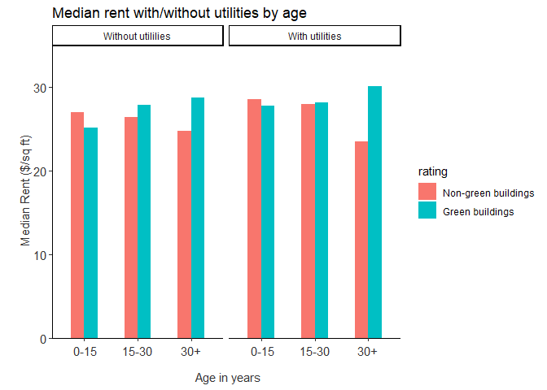
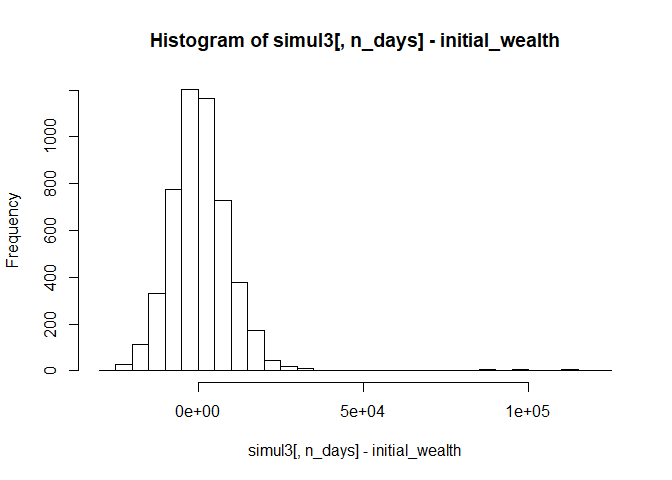

    ## corrplot 0.84 loaded

**Probability Practice**
========================

### Part A.

**Given:**

-   P(RC) = 0.3
-   P(Yes|RC) and P(No|RC) = 0.5
-   P(Yes) = 0.65 and P(No) = 0.35

From the first bullet we can say that P(TC) = 1-P(RC) = 0.7. Let us
assume that the probability of Yes given its TC i.e. P(Yes|TC) is x.

=&gt; *P*(*Y**e**s*|*T**C*)+*P*(*Y**e**s*|*R**C*)=*P*(*Y**e**s*)

=&gt; *x* \* 0.7 + 0.5 \* 0.3 = 0.65

=&gt; *x* = 0.71428

Thus 71.428% of the people who are truthful clickers answered Yes.

### Part B.

**Given:**

-   P(positive-test|disease) = 0.993
-   P(negative-test|Nodisease) = 0.9999
-   P(disease) = 0.000025

We need to find P(disease|+ve\_test). From Bayes theorem -

*P*(*d**i**s**e**a**s**e*|*p**o**s**i**t**i**v**e* − *t**e**s**t*)=(*P*(*p**o**s**i**t**i**v**e* − *t**e**s**t*|*d**i**s**e**a**s**e*)\**P*(*d**i**s**e**a**s**e*))/*P*(*p**o**s**i**t**i**v**e* − *t**e**s**t*)

**Now,**
*P*(*p**o**s**i**t**i**v**e* − *t**e**s**t*)=*P*(*d**i**s**e**a**s**e*)\**P*(*p**o**s**i**t**i**v**e* − *t**e**s**t*|*d**i**s**e**a**s**e*)+*P*(*N**o**d**i**s**e**a**s**e*)\**P*(*p**o**s**i**t**i**v**e* − *t**e**s**t*|*N**o**d**i**s**e**a**s**e*)

    ## [1] 0.1988824

Thus, there is 19.88% probability that when someone tests positive they
would actually have the disease. The problem with this testing outcome
is that the probaility of having a disease even when the test gives
positive results is just 19.8%, while the test gives +ve results with a
probability of 99.3%. This is because a lot of patients who are not
likely to have the disease would also be identified as positives by the
test (false psitives) due to highly skewed incidence of the disease.

**Exploratory Analysis: Green Buildings**
-----------------------------------------

**As we can see from the graph above there are a few houses which have
&lt;10% occupancy rate. It does make sense to remove them to keep our
analysis robust enough.**

    ## [1] 7679   23

**We have 7679 houses in our data set after removing the houses which
have &lt;10% occpancy.**

Let us look if there is any missing data in our data set -

    ##     CS_PropertyID           cluster              size           empl_gr 
    ##                 0                 0                 0                73 
    ##              Rent      leasing_rate           stories               age 
    ##                 0                 0                 0                 0 
    ##         renovated           class_a           class_b              LEED 
    ##                 0                 0                 0                 0 
    ##        Energystar      green_rating               net         amenities 
    ##                 0                 0                 0                 0 
    ##       cd_total_07        hd_total07       total_dd_07     Precipitation 
    ##                 0                 0                 0                 0 
    ##         Gas_Costs Electricity_Costs      cluster_rent 
    ##                 0                 0                 0

**Overall the data seems to be clean with 73 missing data points in the
employment growth rate.**

Now let us try to double check the differnece between the median rent of
houses per sq ft of area for the green houses vs. the non-green houses
as stated by the statistician.

**As we can see from the graph above, it is true that the median rent
(per sq ft) of the green buildings is about $2.6 more than that of
non-green buildings However there are other factors than just the
overall median rent which we should consider to evaluate the
cost-benefit analysis of investing in a green house. Below is a summary
of some of them which will help us decide better whether we should build
a green building or not.**

1.  Let's first evaluate whether the median calculated above is actually
    correct! The median rent was calculated from all the homes which
    have &gt;=10% occupancy. However, here are some homes for which the
    rent does not include the utility costs while most other homes have
    their utility costs included in quoted rent price. Below is a small
    table for the same.

<!-- -->

    ##    green_rating
    ##     Non-green buildings Green buildings
    ##   0                6761             645
    ##   1                 234              39

**From the above table we can say that (234+39) = 273 buildings do not
include utilities in the quoted rent. It seems here that the
statisticians was including these 2 type of rents in his analysis which.
Thus we need to separate out these rents**

**The left graph shows the median rent for non-green and green buildings
when the rent included the utilities, while the right graph shows the
same when the rent does not include utilities. Clearly, after separating
these rents, green buildings seem to have the median rent of $28.2,
which is approximately $3 more than the median rent of non-green
buildings. This is more than what the statistician predicted.**

**However, there still exists a big problem. We can't simply take the
median of all the buildings in the US and compare it between green and
non-green buildings. We need to look at geographical locations which
will significantly impact the building prices. Thus it will be good to
look at each of the clusters to understand the difference in prices
between green and non-green buuildings.**

However before we process ahead, let us see how the distribution of rent
looks like for green buildings .

**We can see that there are certainly some outliers and thus we should
be careful in only taking median values.**

1.  Below we will look at the relationship of the green buildings rent
    with the average cluster rent.

**Clearly based on the above graph there is a positive correlation
between the green bjuilding prices and average cluster rent.**

1.  Let us now compare how much more or less are the green house prices

**The above graph shows the difference in the rent of green building and
the average cluster rent against the green buildings rent. Ee can
observe that a majority of the green buildings have a higher rent than
the average cluster rent.**

1.  We will now quantify the proportion of green buildings which have a
    higher rent than the average cluster rent and then try to identify
    its average magnitude over all the clusters.

**From the above graph we can observe that three-fourths (76.1%) of the
green buildings have a higher rent than the average rent of the
cluster.**

1.  Finally, let's look at how different is the overall average of all
    the green buildings across all the clusters and the average of the
    clusters

**The above graph shows the median rent of all the green buildings and
the mean of all the clusters. Although this analysis also leads to the
conclusion that green buildings could be ~$3 more in rent, we are
missing the most critical thing of comparing medians for all the
buildings without accounting for other variables.**

**6. The problem of comparing the wrong means is still present because
we are comparing the buildings with different age, material and
amenities with each other. We will try to see the differences between
the rent by differrnt age buckets and among buildings with/without
utilities.**

**From the above graphs we can see that non-green buildings are actually
expensive for the first 15 years, while the green buildings seem to be
more expensive from 15+ years. However, if we compare the first 30 years
there does not seem to be any major difference between the buildings of
similar ages! And thus it would be very difficult to get back the
initial investment. Overall, I would recommend to not go ahead with
developing the green building.**

**Bootstrapping**
-----------------

    ## Loading required package: xts

    ## Loading required package: zoo

    ## 
    ## Attaching package: 'zoo'

    ## The following objects are masked from 'package:base':
    ## 
    ##     as.Date, as.Date.numeric

    ## Loading required package: TTR

    ## Version 0.4-0 included new data defaults. See ?getSymbols.

    ## 'getSymbols' currently uses auto.assign=TRUE by default, but will
    ## use auto.assign=FALSE in 0.5-0. You will still be able to use
    ## 'loadSymbols' to automatically load data. getOption("getSymbols.env")
    ## and getOption("getSymbols.auto.assign") will still be checked for
    ## alternate defaults.
    ## 
    ## This message is shown once per session and may be disabled by setting 
    ## options("getSymbols.warning4.0"=FALSE). See ?getSymbols for details.

    ## 
    ## WARNING: There have been significant changes to Yahoo Finance data.
    ## Please see the Warning section of '?getSymbols.yahoo' for details.
    ## 
    ## This message is shown once per session and may be disabled by setting
    ## options("getSymbols.yahoo.warning"=FALSE).

    ## [1] "SPY" "TLT" "LQD" "EEM" "VNQ"

**Let us explore the data starting with SPY (US domestic equities)**

1.  Plotting closing price of exchange traded funds over time to get
    both the good and bad runs of the market

**From the above graph we can see that in 2007 most of the financial
markets were performing well and were at a life time high in mid 2007.
It was ins 2008 the financial crisis started with a significant slump in
2009. However after that the SPY index has mostly climed up.**

1.  Understanding the risk/return values for the 5 traded funds

<!-- -->

    ##      Index              ClCl.SPYa            ClCl.TLTa         
    ##  Min.   :2007-01-03   Min.   :-0.0984477   Min.   :-0.0504495  
    ##  1st Qu.:2009-11-24   1st Qu.:-0.0038636   1st Qu.:-0.0052394  
    ##  Median :2012-10-17   Median : 0.0006589   Median : 0.0005553  
    ##  Mean   :2012-10-20   Mean   : 0.0003989   Mean   : 0.0002710  
    ##  3rd Qu.:2015-09-15   3rd Qu.: 0.0056254   3rd Qu.: 0.0056656  
    ##  Max.   :2018-08-08   Max.   : 0.1451977   Max.   : 0.0516616  
    ##                       NA's   :1            NA's   :1           
    ##    ClCl.LQDa            ClCl.EEMa            ClCl.VNQa         
    ##  Min.   :-0.0911111   Min.   :-0.1616620   Min.   :-0.1951372  
    ##  1st Qu.:-0.0019182   1st Qu.:-0.0085267   1st Qu.:-0.0069231  
    ##  Median : 0.0004104   Median : 0.0008056   Median : 0.0006617  
    ##  Mean   : 0.0002066   Mean   : 0.0009985   Mean   : 0.0004095  
    ##  3rd Qu.: 0.0024758   3rd Qu.: 0.0092223   3rd Qu.: 0.0077793  
    ##  Max.   : 0.0976772   Max.   : 1.8891250   Max.   : 0.1700654  
    ##  NA's   :1            NA's   :1            NA's   :1

    ## [[1]]
    ## NULL
    ## 
    ## [[2]]
    ## NULL
    ## 
    ## [[3]]
    ## NULL
    ## 
    ## [[4]]
    ## NULL
    ## 
    ## [[5]]
    ## NULL

    ##    ClCl.SPYa            ClCl.TLTa            ClCl.LQDa         
    ##  Min.   :-0.0984477   Min.   :-0.0504495   Min.   :-0.0911111  
    ##  1st Qu.:-0.0038636   1st Qu.:-0.0052394   1st Qu.:-0.0019182  
    ##  Median : 0.0006589   Median : 0.0005553   Median : 0.0004104  
    ##  Mean   : 0.0003989   Mean   : 0.0002710   Mean   : 0.0002066  
    ##  3rd Qu.: 0.0056254   3rd Qu.: 0.0056656   3rd Qu.: 0.0024758  
    ##  Max.   : 0.1451977   Max.   : 0.0516616   Max.   : 0.0976772  
    ##    ClCl.EEMa            ClCl.VNQa         
    ##  Min.   :-0.1616620   Min.   :-0.1951372  
    ##  1st Qu.:-0.0085267   1st Qu.:-0.0069231  
    ##  Median : 0.0008056   Median : 0.0006617  
    ##  Mean   : 0.0009985   Mean   : 0.0004095  
    ##  3rd Qu.: 0.0092223   3rd Qu.: 0.0077793  
    ##  Max.   : 1.8891250   Max.   : 0.1700654

**Based on the above summary and graphs plotted we can identify the
volatile and safer funds. If we look at the difference in max and min
returns, we will see that EEMa and VNQa have the highest return, while
SPYa, TLTa and LQDa seem to be safer from the same analysis.**

    ## Loading required package: dplyr

    ## 
    ## Attaching package: 'dplyr'

    ## The following objects are masked from 'package:xts':
    ## 
    ##     first, last

    ## The following object is masked from 'package:gridExtra':
    ## 
    ##     combine

    ## The following objects are masked from 'package:stats':
    ## 
    ##     filter, lag

    ## The following objects are masked from 'package:base':
    ## 
    ##     intersect, setdiff, setequal, union

    ## Loading required package: lattice

    ## Loading required package: ggformula

    ## Loading required package: ggstance

    ## 
    ## Attaching package: 'ggstance'

    ## The following objects are masked from 'package:ggplot2':
    ## 
    ##     geom_errorbarh, GeomErrorbarh

    ## 
    ## New to ggformula?  Try the tutorials: 
    ##  learnr::run_tutorial("introduction", package = "ggformula")
    ##  learnr::run_tutorial("refining", package = "ggformula")

    ## Loading required package: mosaicData

    ## Loading required package: Matrix

    ## 
    ## The 'mosaic' package masks several functions from core packages in order to add 
    ## additional features.  The original behavior of these functions should not be affected by this.
    ## 
    ## Note: If you use the Matrix package, be sure to load it BEFORE loading mosaic.

    ## 
    ## Attaching package: 'mosaic'

    ## The following object is masked from 'package:Matrix':
    ## 
    ##     mean

    ## The following objects are masked from 'package:dplyr':
    ## 
    ##     count, do, tally

    ## The following object is masked from 'package:ggplot2':
    ## 
    ##     stat

    ## The following object is masked from 'package:ggthemes':
    ## 
    ##     theme_map

    ## The following objects are masked from 'package:stats':
    ## 
    ##     binom.test, cor, cor.test, cov, fivenum, IQR, median,
    ##     prop.test, quantile, sd, t.test, var

    ## The following objects are masked from 'package:base':
    ## 
    ##     max, mean, min, prod, range, sample, sum

    ##       5% 
    ## 6119.365

**Thus the value at risk @5% for the first portfolio is 6119.3652777**

Safer investment than the even split

    ##       5% 
    ## 3175.961

**The value at risk @5% for the safer portfolio is 3175.9612965**

Aggressive investment than the even split

    ##      5% 
    ## 12728.2

**The value at risk @5% for the aggressive portfolio is
1.272820310^{4}**

Compare the 3 portfolios

    ##         Portfolio Type   Average Profit              VAR
    ## 1       even_portfolio 100791.129901285 6119.36527767249
    ## 2      safer_portfolio 100604.242242177 3175.96129645449
    ## 3 aggressive_portfolio 101105.507598815  12728.202515057

**Overall after analyzing the VAR for the 3 portfolios we can say that
the aggressive portfolio does have a higher VAR, however it also has a
higher return. So, the investor needs to take a decision based on
his/her risk apetite. If they are willing to take a higher risk they can
invest in EMEa**

**Market Segmentation**
-----------------------

    ## [1] 7882   37

**Overall after removing some of the extra data we have 7447 rows**

**Based on the 2 plots above it seems that there have been a lot of
mentions of photo-sharing, health nutrition, sports fandom, travel,
current events and college\_university. We should however look whether
there are any interesting correlations among these variables to beter
profile the segments.**

Below we will see the correlation between different variables

**Based on the correlation matrix we find the following variables
correlated among themselves. This means that the customer segments could
be defined using these correlated variables-**

-   **Travel, politics, news and computers**
-   **Photo-sharing, cooking, beauty, and fashion**
-   **TV\_film, art**
-   **Online playing, college\_univ, sports playing**
-   **health\_nutrition, personal\_fitness, business**
-   **sports\_fandom, parenting, school, religion**

**We will explore these below through clustering and try to identify key
segments for the company.**

image: 

**The table above shows the value of the cluster centers for each
cluster and each interest. We can see interesting similarities between
the 6 clusters. Below is the description for each of them.**

-   Clust 1 (c1) - We can see that the people in this cluster do not
    tweet about anything except for spam and adult content. It might be
    possible that these are either bots or spams

-   Clust 2 (c2) - These are the people who mostly tweet about
    photo-sharing, fashion, art, music and seem to be interested in
    topics related to beauty

-   Clust 3 (c3) - These people mostly tweet about tv and film,
    college/university and about playing sports. These could potentially
    be college going people who are interested in these topics.

-   Clust 4 (c4) - These set of people seem to like to tweet about
    healthy life, personal fitness and outdoor activities

-   Clust 5 (C5) - These people are mostly tweeting about travel,
    politics and are interested in news

-   Clust 6 (c6) - These people are mostly tweeting about religion,
    parenting, school and family. These might be parents.
