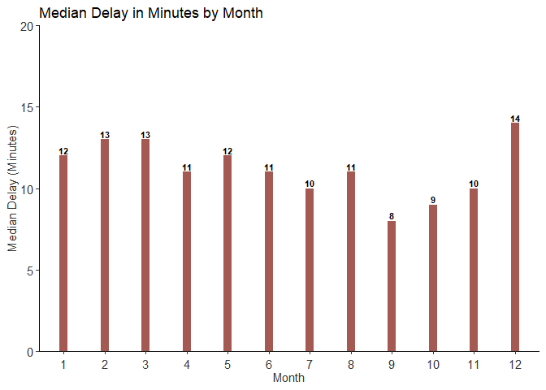

    ## corrplot 0.84 loaded

    ## -- Attaching packages ------------------------------------------------------- tidyverse 1.2.1 --

    ## v ggplot2 3.0.0     v purrr   0.2.5
    ## v tibble  1.4.2     v dplyr   0.7.6
    ## v tidyr   0.8.1     v stringr 1.3.1
    ## v readr   1.1.1     v forcats 0.3.0

    ## -- Conflicts ---------------------------------------------------------- tidyverse_conflicts() --
    ## x dplyr::filter() masks stats::filter()
    ## x dplyr::lag()    masks stats::lag()

    ## 
    ## Attaching package: 'data.table'

    ## The following objects are masked from 'package:dplyr':
    ## 
    ##     between, first, last

    ## The following object is masked from 'package:purrr':
    ## 
    ##     transpose

    ## 
    ## Attaching package: 'gridExtra'

    ## The following object is masked from 'package:dplyr':
    ## 
    ##     combine

    ## 
    ## Attaching package: 'reshape2'

    ## The following objects are masked from 'package:data.table':
    ## 
    ##     dcast, melt

    ## The following object is masked from 'package:tidyr':
    ## 
    ##     smiths

    ## -------------------------------------------------------------------------

    ## You have loaded plyr after dplyr - this is likely to cause problems.
    ## If you need functions from both plyr and dplyr, please load plyr first, then dplyr:
    ## library(plyr); library(dplyr)

    ## -------------------------------------------------------------------------

    ## 
    ## Attaching package: 'plyr'

    ## The following objects are masked from 'package:dplyr':
    ## 
    ##     arrange, count, desc, failwith, id, mutate, rename, summarise,
    ##     summarize

    ## The following object is masked from 'package:purrr':
    ## 
    ##     compact

    ## Loading required package: Matrix

    ## 
    ## Attaching package: 'Matrix'

    ## The following object is masked from 'package:tidyr':
    ## 
    ##     expand

    ## 
    ## Attaching package: 'arules'

    ## The following object is masked from 'package:dplyr':
    ## 
    ##     recode

    ## The following objects are masked from 'package:base':
    ## 
    ##     abbreviate, write

**We are trying to analyze the following key questions from the flights
data -**

**1. What is the frequency of flights which departed/arrived Austin
every month** **2. What is the frequency of flights which
departed/arrived Austin in every day of week and hour of day** **3. What
are the most common destinations from Austin** **4. How does the flight
patterns / frequency change for the top destinations over the year**
**5. Among the flights which departed Austin, how many got delayed**
**6. Among the flights which got delayed, what is the average delay
time**

    ##  [1] "Year"              "Month"             "DayofMonth"       
    ##  [4] "DayOfWeek"         "DepTime"           "CRSDepTime"       
    ##  [7] "ArrTime"           "CRSArrTime"        "UniqueCarrier"    
    ## [10] "FlightNum"         "TailNum"           "ActualElapsedTime"
    ## [13] "CRSElapsedTime"    "AirTime"           "ArrDelay"         
    ## [16] "DepDelay"          "Origin"            "Dest"             
    ## [19] "Distance"          "TaxiIn"            "TaxiOut"          
    ## [22] "Cancelled"         "CancellationCode"  "Diverted"         
    ## [25] "CarrierDelay"      "WeatherDelay"      "NASDelay"         
    ## [28] "SecurityDelay"     "LateAircraftDelay"

**As expected the \# of flights to and from Austin each month are same.
There seems to be a higher number of flights in June while much lower in
December(probably because lesser people come here for vacations).**

**Now, lets look at the number of flights by each hour of the day**

**Now let's try to understand the delays by hours - Is it that the hours
when there is a higher frequency have higher amounts of delays**

**Most of the delays happen in the 3rd month (March) and 12th month
(December)** **When looking at hour of day, most of the delays happen
after 8 PM till 1 AM. You would notice that there are no flights between
2-4 AM**

**Now among the flights which were delayed, let's caculate the average
delay time by month and hour of day**

**The median delay is approx. 14 minutes every months. However when we
compare across hour of the day we realize that**

Interestingly, most of the flights from Austin are to Dallas and
Dallas/Fort Worth

**Interestingly, the number of flights drop for Dallas in the 7th
month!**

**Finally, let's look at the delays by most frequent destinations and
the "worst"" destinations.**

**Top destinations - Based on the number of flights going out from
Austin** **Worst Destinations - Based on the proportion of delayed
flights**

**DELAYS BY TOP DESTINATIONS**

**The first graph shows a heat-map of median delay times for the top
destinations against months, while the second graph shows the same
against hour of day. Below are some of the insights from these graphs**

-   Almost all the destinations have a higher delay time in December
-   For DFW and IAH there are huge delays during August. DFW also has
    high delay times in May
-   There does not seem to be a big difference in delay times by the
    hour of the day except for midnight flights (11 PM-12 AM)

**DELAYS BY "WORST" DESTINATIONS**

**OKC, OAK and TPA have one of the highest flight delays and can be
classified as one of the "worst" destinations.**

**Overall based on the graphs above we can conclude the following:**

-   September, October and November are one of the best months to travel
    from Austin
-   Wihin these months if you take an early morning (5 AM) flights you
    have the least chances of being late. If however 5 AM is to early
    delays at 6 AM and 8 AM are not too bad either
-   However, if yyou are planning to go to IAH or DFW, maybe you should
    avoid going in August as there are significant delays in that month
-   Lastly be prepared for delays if you are plannig to go to OKC
    (Oklahoma City), OAK (Oakland) and TPA(Tampa)

**Practice with association rule mining**
-----------------------------------------

**Below we will try to understand interesting associations between the
grocery items boght by customers.**

    ## Loading required package: MASS

    ## 
    ## Attaching package: 'MASS'

    ## The following object is masked from 'package:dplyr':
    ## 
    ##     select

    ## Apriori
    ## 
    ## Parameter specification:
    ##  confidence minval smax arem  aval originalSupport maxtime support minlen
    ##         0.5    0.1    1 none FALSE            TRUE       5   0.001      1
    ##  maxlen target   ext
    ##       5  rules FALSE
    ## 
    ## Algorithmic control:
    ##  filter tree heap memopt load sort verbose
    ##     0.1 TRUE TRUE  FALSE TRUE    2    TRUE
    ## 
    ## Absolute minimum support count: 9 
    ## 
    ## set item appearances ...[0 item(s)] done [0.00s].
    ## set transactions ...[169 item(s), 9835 transaction(s)] done [0.00s].
    ## sorting and recoding items ... [157 item(s)] done [0.00s].
    ## creating transaction tree ... done [0.00s].
    ## checking subsets of size 1 2 3 4 5

    ## Warning in apriori(groceriestrans, parameter = list(support = 0.001,
    ## confidence = 0.5, : Mining stopped (maxlen reached). Only patterns up to a
    ## length of 5 returned!

    ##  done [0.02s].
    ## writing ... [5622 rule(s)] done [0.00s].
    ## creating S4 object  ... done [0.00s].

    ##      lhs                        rhs                  support confidence     lift count
    ## [1]  {Instant food products,                                                          
    ##       soda}                  => {hamburger meat} 0.001220132  0.6315789 18.99565    12
    ## [2]  {popcorn,                                                                        
    ##       soda}                  => {salty snack}    0.001220132  0.6315789 16.69779    12
    ## [3]  {baking powder,                                                                  
    ##       flour}                 => {sugar}          0.001016777  0.5555556 16.40807    10
    ## [4]  {ham,                                                                            
    ##       processed cheese}      => {white bread}    0.001931876  0.6333333 15.04549    19
    ## [5]  {Instant food products,                                                          
    ##       whole milk}            => {hamburger meat} 0.001525165  0.5000000 15.03823    15
    ## [6]  {curd,                                                                           
    ##       other vegetables,                                                               
    ##       whipped/sour cream,                                                             
    ##       yogurt}                => {cream cheese }  0.001016777  0.5882353 14.83409    10
    ## [7]  {domestic eggs,                                                                  
    ##       processed cheese}      => {white bread}    0.001118454  0.5238095 12.44364    11
    ## [8]  {other vegetables,                                                               
    ##       tropical fruit,                                                                 
    ##       white bread,                                                                    
    ##       yogurt}                => {butter}         0.001016777  0.6666667 12.03058    10
    ## [9]  {hamburger meat,                                                                 
    ##       whipped/sour cream,                                                             
    ##       yogurt}                => {butter}         0.001016777  0.6250000 11.27867    10
    ## [10] {liquor,                                                                         
    ##       red/blush wine}        => {bottled beer}   0.001931876  0.9047619 11.23527    19

**Let's also try to visualize these interesting associations in a
graph**

**Based on this below are some of the interesting associations -**

-   Soda, Pop-corn =&gt; Salty Snacks
-   Instant food products, soda =&gt; Hamburger meat
-   Baking powder, flour =&gt; Sugar
-   Curd =&gt; Whole milk
-   Curd, other vegetables,whipped/sour-cream,yougurt =&gt; cream cheese
-   Domestic eggs, procesed cheese =&gt; White bread
-   Liquor, Red/blush wine =&gt; Bottled beer

**Although these are the top associations, we must note that there are
only a few transactions for these with very small support.**

**Author Atribution**
---------------------

**Below is the code to predict authors for documents in the RC50
(Reuters) dataset.**

    library(tm) 

    ## Loading required package: NLP

    ## 
    ## Attaching package: 'NLP'

    ## The following object is masked from 'package:ggplot2':
    ## 
    ##     annotate

    ## 
    ## Attaching package: 'tm'

    ## The following object is masked from 'package:arules':
    ## 
    ##     inspect

    library(magrittr)

    ## 
    ## Attaching package: 'magrittr'

    ## The following object is masked from 'package:ggmap':
    ## 
    ##     inset

    ## The following object is masked from 'package:purrr':
    ## 
    ##     set_names

    ## The following object is masked from 'package:tidyr':
    ## 
    ##     extract

    library(randomForest)

    ## randomForest 4.6-14

    ## Type rfNews() to see new features/changes/bug fixes.

    ## 
    ## Attaching package: 'randomForest'

    ## The following object is masked from 'package:gridExtra':
    ## 
    ##     combine

    ## The following object is masked from 'package:dplyr':
    ## 
    ##     combine

    ## The following object is masked from 'package:ggplot2':
    ## 
    ##     margin

    library(caret)

    ## Loading required package: lattice

    ## 
    ## Attaching package: 'caret'

    ## The following object is masked from 'package:purrr':
    ## 
    ##     lift

    library(e1071)

    # Setitng the working directory
    setwd("C:/Users/bandi/Desktop/Predictive Modeling")

    # Function to read the files
    readerPlain = function(fname){
      readPlain(elem=list(content=readLines(fname)), 
                id=fname, language='en')
    } 
    # Get the filenames from the train data set
    filenames <- list.files("./Part 2/STA380/data/ReutersC50/C50train", recursive=TRUE)
    myname = strsplit(filenames, "[/]")
    author_name = NULL
    for (i in 1:length(myname)) {
      author_name = c(author_name,myname[[i]][1])
    }
    class_labels_train = author_name
    author_name_train = unique(author_name)

    # Get the files in an array
    file_list_train <- NULL
    for (name in author_name_train){
      file_list_train <- c(file_list_train, Sys.glob(paste0('./Part 2/STA380/data/ReutersC50/C50train/',name,'/*.txt')))
    }

    # Read all files
    all_docs_train = lapply(file_list_train, readerPlain)

    mynames_train = file_list_train %>%
    { strsplit(., '/', fixed=TRUE) } %>%
    { lapply(., tail, n=2) } %>%
    { lapply(., paste0, collapse = '') } %>%
      unlist

    # create a dataframe with doc_id as author-article and text as the text in that article
    text_vector_train <- NULL

    for(i in 1:length(mynames_train)){
      text_vector_train <- c(text_vector_train, paste0(content(all_docs_train[[i]]), collapse = " "))
    }

    # dataframe with text and document_id
    text_df_train <- data.frame(doc_id = mynames_train,
                                text = text_vector_train)

    ## once you have documents in a vector, you 
    ## create a text mining 'corpus' with: 
    train_raw <- VCorpus(DataframeSource(text_df_train))

    ## Some pre-processing/tokenization steps.
    my_documents_train = train_raw
    my_documents_train = tm_map(my_documents_train, content_transformer(tolower))
    my_documents_train = tm_map(my_documents_train, content_transformer(removeNumbers))
    my_documents_train = tm_map(my_documents_train, content_transformer(removePunctuation))
    my_documents_train = tm_map(my_documents_train, content_transformer(stripWhitespace))

    # Removing stop words
    my_documents_train = tm_map(my_documents_train, content_transformer(removeWords), stopwords("en"))

    ## create a doc-term-matrix
    DTM_train = DocumentTermMatrix(my_documents_train)

    # Remove sparse terms
    DTM_train = removeSparseTerms(DTM_train, 0.99)
    DTM_train # now 3325 terms (versus ~32570 terms before)

    ## <<DocumentTermMatrix (documents: 2500, terms: 3325)>>
    ## Non-/sparse entries: 376957/7935543
    ## Sparsity           : 95%
    ## Maximal term length: 20
    ## Weighting          : term frequency (tf)

    # Now, let us repeat the above process of creating DTM for the test data
    filenames <- list.files("./Part 2/STA380/data/ReutersC50/C50test", recursive=TRUE)
    myname = strsplit(filenames, "[/]")
    author_name = NULL
    for (i in 1:length(myname)) {
      author_name = c(author_name,myname[[i]][1])
    }
    class_labels_test = author_name
    author_name = unique(author_name)
    file_list_test = NULL
    #class_labels_test = NULL
    for (each in author_name) {
      file_list_test = c(file_list_test,Sys.glob(paste0('./Part 2/STA380/data/ReutersC50/C50test/',each,'/*.txt')))
    }
    all_docs_test = lapply(file_list_test, readerPlain)
    mynames_test = file_list_test %>%
    { strsplit(., '/', fixed=TRUE) } %>%
    { lapply(., tail, n=2) } %>%
    { lapply(., paste0, collapse = '') } %>%
      unlist

    # create a dataframe with doc_id as author-article and text as the text in that article
    text_vector_test <- NULL

    for(i in 1:length(mynames_test)){
      text_vector_test <- c(text_vector_test, paste0(content(all_docs_test[[i]]), collapse = " "))
    }

    # dataframe with text and document_id
    text_df_test <- data.frame(doc_id = mynames_test,
                                text = text_vector_test)

    # convert the dataframe to a Corpus
    test_raw <- VCorpus(DataframeSource(text_df_test))

    ## Some pre-processing/tokenization steps.
    ## tm_map just maps some function to every document in the corpus
    my_documents_test = test_raw
    my_documents_test = tm_map(my_documents_test, content_transformer(tolower))
    my_documents_test = tm_map(my_documents_test, content_transformer(removeNumbers))
    my_documents_test = tm_map(my_documents_test, content_transformer(removePunctuation))
    my_documents_test = tm_map(my_documents_test, content_transformer(stripWhitespace))

    # Removing stop words
    my_documents_test = tm_map(my_documents_test, content_transformer(removeWords), stopwords("en"))

    ## create a doc-term-matrix
    DTM_test = DocumentTermMatrix(my_documents_test)
    summary(Terms(DTM_test) %in% Terms(DTM_train))

    ##    Mode   FALSE    TRUE 
    ## logical   29264    3325

**There are 32,589 words in document-term matrix for the test data,
however there are only 3325 words which are also common in the train
data set. So, let us drop the remaining words for the classification
problem. This is however not an optimal solution, as we are dropping
many words.**

    # A suboptimal but practical solution: ignore words you haven't seen before
    # can do this by pre-specifying a dictionary in the construction of a DTM
    DTM_test2 = DocumentTermMatrix(my_documents_test,
                                   control = list(dictionary=Terms(DTM_train)))

    # Now checking whether we have all the words from train in test
    summary(Terms(DTM_test2) %in% Terms(DTM_train))

    ##    Mode    TRUE 
    ## logical    3325

**Now creating the TF-IDF matrix for test and train data**

    # Now lets create TF-IDF matrix for train and test
    tfidf_train = weightTfIdf(DTM_train)
    tfidf_test = weightTfIdf(DTM_test2)

    # Converting tfidf_train to matrix
    tfidf_train = as.matrix(tfidf_train)
    tfidf_train = tfidf_train[ , apply(tfidf_train, 2, var) != 0]

**3325 words are still high to conduct classification. Thus we will
reduce the dimensions using Principal Component Analysis. We will run
the PCAs on the train data set and take the top words which explain 75%
of the variability in data.**

    # Run PCA on TF-IDF to reduce the number of words
    pc_train = prcomp(as.matrix(tfidf_train), scale=TRUE)

    # Let's use the top PCs which explain 75% of the variability. So we will take first 330 PCs
    X_train = pc_train$x[,1:330]
    X_train  = cbind(X_train,class_labels_train)

    # Now scale the test data
    tfidf_test = as.matrix(tfidf_test)
    #tfidf_test = tfidf_test[ , apply(tfidf_test, 2, var) != 0]

    #Scaling the test data and applying PCs from train
    scaled_tfidf_test = scale(tfidf_test, center=TRUE, scale=TRUE)

    X_test <- scaled_tfidf_test %*% pc_train$rotation[,1:330]
    #X_test_pc <- as.data.frame(X_test_pc)

    #X_test = predict(pc_train, scaled_tfidf_test)
    X_test = X_test[,1:330]

**Based on the PCA on train data, we can say that 330 words define 75%
of the variability. Using the PCAs on the train data set, we predicted
the PCAs on test data set. We will use these data sets for our
classification of the authors.**

**Classification - 1. Random Forest.**

    X_train = as.data.frame(X_train)

    for (name in names(X_train)){
      if (name == "class_labels_train"){
        next
      }else{
        X_train[[name]] <- as.numeric(as.character(X_train[[name]]))
      }
    }
    X_test = as.data.frame(X_test)
    set.seed(99)
    author.rf = randomForest(class_labels_train ~., 
                             data = X_train,
                             ntrees = 500,
                             importance = TRUE)

    predict_test = predict(author.rf,X_test,type="response")
    rf_confusion_matrix = table(predict_test,class_labels_test)
    accuracy = sum(diag(rf_confusion_matrix)) / sum(rf_confusion_matrix)
    accuracy

    ## [1] 0.5896

**After running Random Forest we have an acuracy of 58%. Let us however
look at how does the accuracy varyfor different authors**

    library(dplyr)
    accurate_authors = as.data.frame(cbind(unique(class_labels_train),
                                           diag(rf_confusion_matrix)))
    colnames(accurate_authors) = c("Authors","Correct_Predictions")
    accurate_authors$Correct_Predictions =  as.numeric(as.character(accurate_authors$Correct_Predictions))
    accurate_authors$Authors = as.character(accurate_authors$Authors)
    accurate_authors_sorted = accurate_authors[order(-accurate_authors$Correct_Predictions),]
    accurate_authors_sorted$percentage_accuracy = accurate_authors_sorted$Correct_Predictions/50
    head(accurate_authors_sorted,10)

    ##                         Authors Correct_Predictions percentage_accuracy
    ## JimGilchrist       JimGilchrist                  50                1.00
    ## LynnleyBrowning LynnleyBrowning                  50                1.00
    ## KarlPenhaul         KarlPenhaul                  46                0.92
    ## RobinSidel           RobinSidel                  45                0.90
    ## AaronPressman     AaronPressman                  44                0.88
    ## MatthewBunce       MatthewBunce                  43                0.86
    ## SimonCowell         SimonCowell                  43                0.86
    ## FumikoFujisaki   FumikoFujisaki                  41                0.82
    ## JoWinterbottom   JoWinterbottom                  41                0.82
    ## NickLouth             NickLouth                  41                0.82

    # Plotting the top accurately predicted authors
    top_n(accurate_authors_sorted, n=5, percentage_accuracy) %>%
              ggplot(., aes(x=reorder(Authors,-percentage_accuracy), y=percentage_accuracy))+
      geom_bar(stat = "identity",fill = 'steelblue',width = 0.4) +
      scale_y_continuous(labels = scales::percent,expand = c(0,0),limits = c(0,1)) +
      labs(title="% Documents Correctly Predicted for Top Predicted Authors",fill = "Departure Delay", fontface='bold')+
      theme_classic()+
      theme(axis.text.x = element_text(colour="grey20",size=9,angle=0,hjust=0.5,vjust=0.2),
            axis.text.y = element_text(colour="grey20",size=11,angle=0),
            axis.title.x = element_text(colour="grey20",size=11,hjust=0.5),
            axis.title.y = element_text(colour="grey20",size=11,hjust=0.5))+
      ylab("% Accuracy") +
      xlab ("Authors") + 
      geom_text(aes(label=paste0(sprintf("%.0f", percentage_accuracy*100),"%")), vjust = 1, size=4,fontface='bold',colour = 'white')

    #PLot the authors which are not predicted that well - 

    top_n(accurate_authors_sorted, n=-5, percentage_accuracy) %>%
              ggplot(., aes(x=reorder(Authors,-percentage_accuracy), y=percentage_accuracy))+
      geom_bar(stat = "identity",fill = 'steelblue',width = 0.4) +
      scale_y_continuous(labels = scales::percent,expand = c(0,0),limits = c(0,1)) +
      labs(title="% Documents Correctly Predicted for Bottom Predicted Authors",fill = "Departure Delay", fontface='bold')+
      theme_classic()+
      theme(axis.text.x = element_text(colour="grey20",size=9,angle=0,hjust=0.5,vjust=0.2),
            axis.text.y = element_text(colour="grey20",size=11,angle=0),
            axis.title.x = element_text(colour="grey20",size=11,hjust=0.5),
            axis.title.y = element_text(colour="grey20",size=11,hjust=0.5))+
      ylab("% Accuracy") +
      xlab ("Authors") + 
      geom_text(aes(label=paste0(sprintf("%.0f", percentage_accuracy*100),"%")), vjust = 1, size=4,fontface='bold',colour = 'white')

**The authors most correctly predicted by Random forest are -
JimGilchrist, LynnleyBrowning, KarlPenhaul, RobinSidel, MatthewBunce,
NickLouth.**

**The authors most incorrectly predicted are - TanEeLyn, ScottHillis,
EdnaFernandes, BenjaminKangLim, DarrenSchuettler.**

**2. Support Vector Machine (SVM)**

    set.seed(99)
    X_train_svm = subset(X_train, select = -class_labels_train) 
    y_train_svm = as.factor(class_labels_train)
    model_svm = svm(X_train_svm, y_train_svm, probability = TRUE)
    pred_prob = predict(model_svm, X_test, decision.values = TRUE, probability = TRUE)

    cm_svm = table(pred_prob,class_labels_test)
    accuracy_svm = sum(diag(cm_svm)) / sum(cm_svm)
    accuracy_svm

    ## [1] 0.5692

**From SVM as well we get an accuracy of 57%.**

**Interestingly, we get similar accuraies in the SVM model as well.
Additionally, the run time for SVM is much lower than Random Forest
algorithm.**

    library(dplyr)
    accurate_authors = as.data.frame(cbind(unique(class_labels_train),
                                           diag(cm_svm)))
    colnames(accurate_authors) = c("Authors","Correct_Predictions")
    accurate_authors$Correct_Predictions =  as.numeric(as.character(accurate_authors$Correct_Predictions))
    accurate_authors$Authors = as.character(accurate_authors$Authors)
    accurate_authors_sorted = accurate_authors[order(-accurate_authors$Correct_Predictions),]
    accurate_authors_sorted$percentage_accuracy = accurate_authors_sorted$Correct_Predictions/50
    head(accurate_authors_sorted,10)

    ##                         Authors Correct_Predictions percentage_accuracy
    ## LynnleyBrowning LynnleyBrowning                  50                1.00
    ## JimGilchrist       JimGilchrist                  46                0.92
    ## GrahamEarnshaw   GrahamEarnshaw                  45                0.90
    ## BradDorfman         BradDorfman                  44                0.88
    ## MatthewBunce       MatthewBunce                  44                0.88
    ## NickLouth             NickLouth                  44                0.88
    ## TheresePoletti   TheresePoletti                  44                0.88
    ## FumikoFujisaki   FumikoFujisaki                  40                0.80
    ## PeterHumphrey     PeterHumphrey                  40                0.80
    ## KirstinRidley     KirstinRidley                  39                0.78

    # Plotting the top accurately predicted authors
    top_n(accurate_authors_sorted, n=5, percentage_accuracy) %>%
              ggplot(., aes(x=reorder(Authors,-percentage_accuracy), y=percentage_accuracy))+
      geom_bar(stat = "identity",fill = 'steelblue',width = 0.4) +
      scale_y_continuous(labels = scales::percent,expand = c(0,0),limits = c(0,1)) +
      labs(title="% Documents Correctly Predicted for Top Predicted Authors",fill = "Departure Delay", fontface='bold')+
      theme_classic()+
      theme(axis.text.x = element_text(colour="grey20",size=8,angle=0,hjust=0.5,vjust=0.2),
            axis.text.y = element_text(colour="grey20",size=11,angle=0),
            axis.title.x = element_text(colour="grey20",size=10,hjust=0.5),
            axis.title.y = element_text(colour="grey20",size=11,hjust=0.5))+
      ylab("% Accuracy") +
      xlab ("Authors") + 
      geom_text(aes(label=paste0(sprintf("%.0f", percentage_accuracy*100),"%")), vjust = 1, size=4,fontface='bold',colour = 'white')

    #PLot the authors which are not predicted that well - 

    top_n(accurate_authors_sorted, n=-5, percentage_accuracy) %>%
              ggplot(., aes(x=reorder(Authors,-percentage_accuracy), y=percentage_accuracy))+
      geom_bar(stat = "identity",fill = 'steelblue',width = 0.4) +
      scale_y_continuous(labels = scales::percent,expand = c(0,0),limits = c(0,1)) +
      labs(title="% Documents Correctly Predicted for Bottom Predicted Authors",fill = "Departure Delay", fontface='bold')+
      theme_classic()+
      theme(axis.text.x = element_text(colour="grey20",size=8,angle=0,hjust=0.5,vjust=0.2),
            axis.text.y = element_text(colour="grey20",size=11,angle=0),
            axis.title.x = element_text(colour="grey20",size=10,hjust=0.5),
            axis.title.y = element_text(colour="grey20",size=11,hjust=0.5))+
      ylab("% Accuracy") +
      xlab ("Authors") + 
      geom_text(aes(label=paste0(sprintf("%.0f", percentage_accuracy*100),"%")), vjust = 1, size=4,fontface='bold',colour = 'white')

**The authors most correctly predicted by SVM are - LynnleyBrowning,
JimGilchrist, GrahamEarnshaw, BradDorfman, MatthewBunce, NickLouth,
TheresePoletti.**

**The authors most incorrectly predicted are - ScottHillis,
DarrenSchuettler, DavidLawder, JanLopatka, BenjaminKangLim.**

**Overall, the outputs of the 2 model does give a similar accuracy of
~58%. While this is not impressive, we do get a lot of authors which
have very hgh accuracies in both the models. Overall accuracy seems to
be low as there are some authors who are not predicted that well. One
potential reason behind this could be that we have dropped quite a few
words form the train and test data sets. However, there are many more
words in the test data (which if incorporated could improve
accuracies).**
